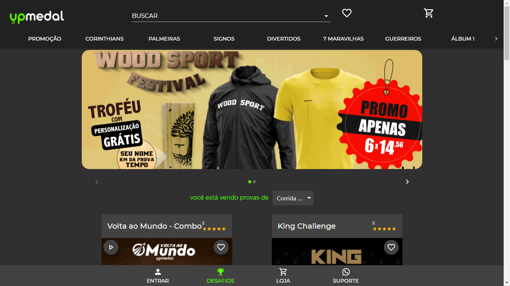

# Desafio#3 - VTEX IO + AWS

## Você foi contratado para desenvolver o ecommerce do seu novo cliente, a UPMedal.com.

### Template de criação

- Criar a solução a partir de um boiler template padrão da Vtex IO

### Layout

- [upmedal.com](https://www.upmedal.com/)
- Observação - A réplica não precisa ser uma cópia fiel deste layout mas tentar
se aproximar o máximo que conseguir
- Utilizar o Markdown + o css para formatação

### Para esta tela utilizar os componentes:

- Flex Layout para criar as cores em css - [vtex.flex-layout@0.17.0](https://vtex.io/docs/components/all/vtex.flex-layout@0.17.0/)
- Dar prioridade as páginas criada nos arquivos.jsonc colocando comentários
dos blocos criados
- Utilizar o Slider layout para mostrar os produtos em destaque - [vtex.slider-layout](https://vtex.io/docs/app/vtex.slider-layout)
- Criar um componente Tab Layout para separar os produtos por categoria - [vtex.tab-layout@0.4.3](https://vtex.io/docs/components/all/vtex.tab-layout@0.4.3/)
- Criar um bloco de lista de produtos - [vtex.product-list@0.31.0](https://vtex.io/docs/app/vtex.product-list@0.31.0/)
- Criar Minicard para lista dos produtos no carrinho - [vtex.minicart@2.60.0/](https://vtex.io/docs/components/content-blocks/vtex.minicart@2.60.0/)
- Ao clicar no produto ir para tela com Product Summary - [vtex.product-summary@2.53.0](https://vtex.io/docs/components/all/vtex.product-summary@2.53.0/)
  
### Layout Mobile

- A página deve ser responsiva

- Criar um componente customizado para falar com suporte no whatsapp, no rodapé ○ Utilizar o Vtex Componentes com React para criar o componente [vtex.store-components@3.150.0](https://vtex.io/docs/components/all/vtex.store-components@3.150.0/)

- Criar um componente customizado para cadastrar leads (possíveis clientes prospectos)
  - Nome
  - Email
  - Telefone
  - Este componente pode servir de isca digital, fazendo dando uma bonificação para o prospecto que preencher as informações da lead.

- Utilizar o Vtex Componentes com React para criar o componente [vtex.store-components@3.150.0](https://vtex.io/docs/components/all/vtex.store-components@3.150.0/)

### AWS API Gateway
- Com o objetivo de armazenar as leads que o Vtex componente irá utilizar no React, criar uma API Gateway na AWS para colocar as informações - [AWS api-gateway](https://aws.amazon.com/pt/api-gateway/)
